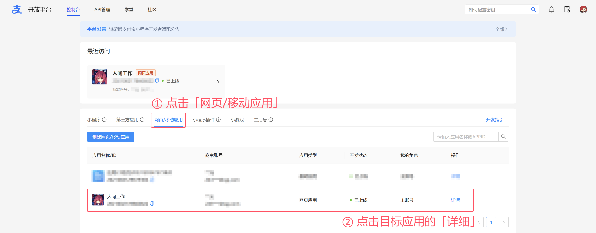
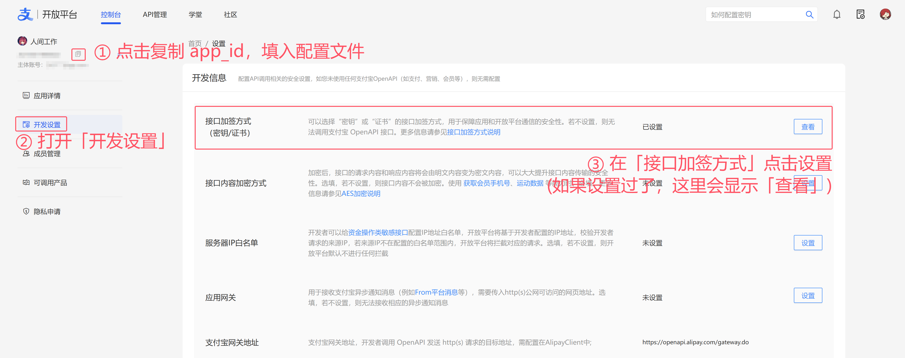
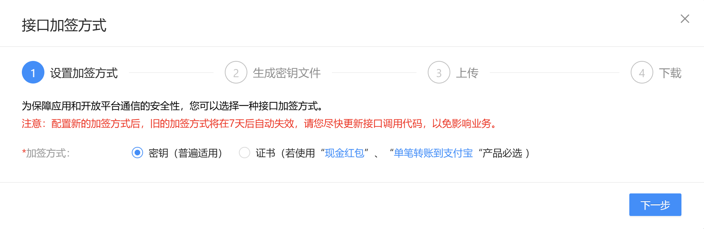
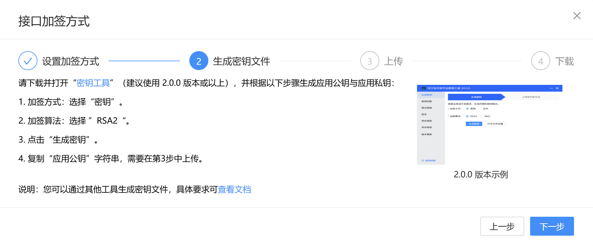
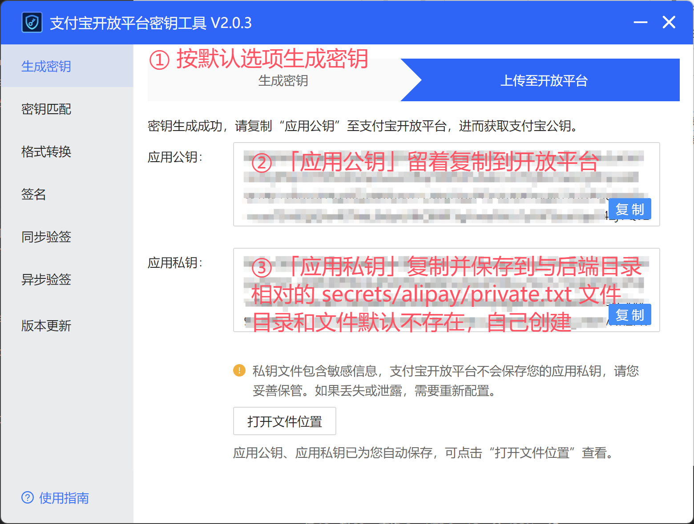
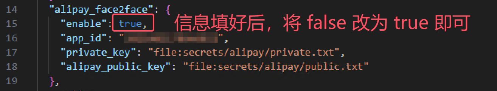

# 支付宝当面付配置

本教程默认你已完成「当面付」相关资质的申请，以及网页应用成功通过审核。

## 1.进入开放平台

https://open.alipay.com/develop/manage

## 2. 设置接口加签方式

  
  
  

按照页面中的提示下载密钥工具

## 3. 生成密钥，并填入后端配置

*错字:* `相当 -> 相对`

重启后端或在后端执行 `reload` 命令生效。
